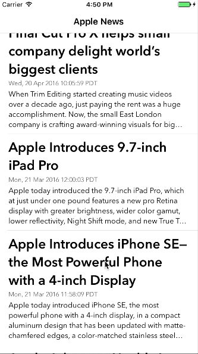

SimpleRSSReader
==========

SimpleRSSReader is a simple app showing the latest Apple news. It demos the usage of following stuff:

- How to use XML Parser Delegate to parse info;
- How to control height of tableView cell dynamically;
- How to expand and collapse tableView cell.

## Screenshots

