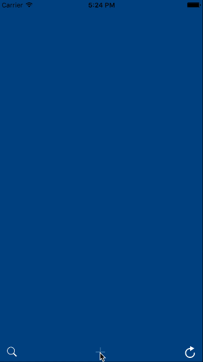

Tumblr
==========

Tumblr is a simple Swift app inspired by [Transitions in Swift](http://mathewsanders.com/custom-menu-transitions-in-swift/). It highly mimics the slide in and slide out transitions of Tumblr. What's more, it shows the implementation of a custom transition manager by extending UIViewControllerAnimatedTransitioning and UIViewControllerTransitioningDelegate protocols.

## Screenshots

