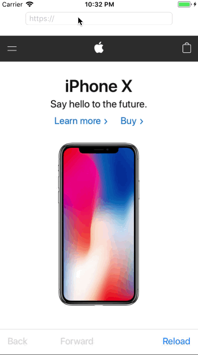

Browser
==========

Browser is an app mocks the safari web browser on iOS side -- it is implemented by WKWebView via using its KVO and Error Handling features with the help of WKNavigationDelegate, UIAlertViewController, UIProgressBar, and UIToolBar.

For all details, please reference [A Look at at the WebKit Framework](https://www.appcoda.com/tag/wkwebview/)

## Screenshots

