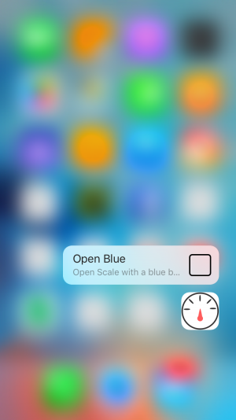

Scale
==========

Scale is an iOS app demos the way to handle 3D Touch. This app is inspired by [*3D Touch Introduction: Building a Digital Scale App and Quick Actions*](http://www.appcoda.com/3d-touch-tutorial/) in tackling force touch and quick actions by Swift.

## Screenshots

