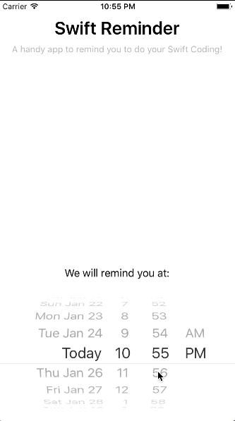

NotificationsUI
==========
NotificationsUI is a Swift App which demos the way of how local notifications work in iOS 10. It is the tutorial app from AppCoda showing below features:

- Notifications triggered by time with simple text
- Image attachment to a notification
- Add a reminder using nofication actions

For details please reference [*Introduction to User Notifications Framework in iOS 10*](https://www.appcoda.com/ios10-user-notifications-guide/))

## Screenshots

