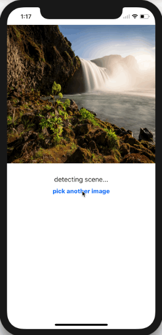

SceneDetector
==========

SceneDetector explains the scenario of Core ML -- using trained GoogLeNetPlaces model to detect scenes of a selected image. Literately 5 steps are required:

1. Drag and drop the .mlmodel to the project
1. Load model from the automatic generated model class of the .mlmodel file
2. Define a Vision service with the model
3. Create a request handler with image provided
4. Perform the request service with the request handler

For more details, please reference [here](https://www.raywenderlich.com/164213/coreml-and-vision-machine-learning-in-ios-11-tutorial).

## Screenshots

