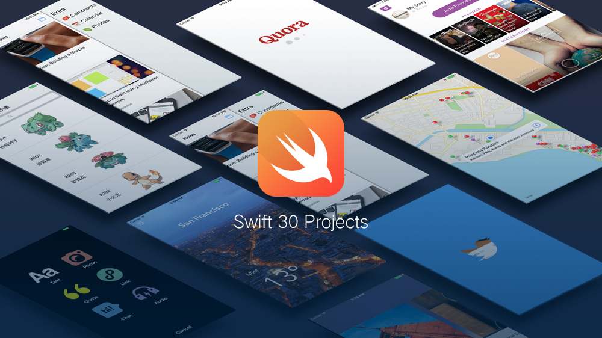
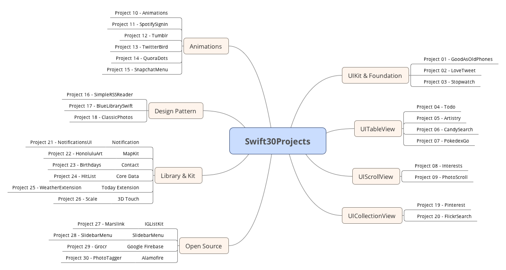

## Swift 30 Projects

## Contents
This repo is updated with Swift 5 and compatible with iPhone X:

* Simple UIKit components
* UIScrollView, UITableView, UICollectionView
* CAAnimations and UIView Animations
* Local Notification in iOS 11
* MapKit, Contact, and Core ML frameworks
* Core Data, Today Extension, and 3D touch
* Popular Open Source Frameworks
* Design Patterns
* Test Driven Development, XCTest

## By developers and for developers

I am an iOS developer and currently using Swift.

**This repo does not merely follow tutorials, I re-build them with better code style and architecture design.**

For code style, I strictly follow [raywenderlich.com Swift Style Guide](https://github.com/raywenderlich/swift-style-guide);

For developers, I have a README file and screenshots for every single app in this repo, all details could be found there.

## What's next?

I will maintain the project with latest syntax and most advanced code style. More code comments are going to be covered as well.

Also, **unit tests** will be added to ensure the quality of the codebase.

## Contributors
[chenluffy](https://github.com/ChengLuffy), [LargeShrimp](https://github.com/LargeShrimp) and [azureland](https://github.com/azureland), thank you for your assistance in optimizing the repo.

## Reach me ##

Twitter: [@guyindaozhang](https://twitter.com/guyindaozhang) 
Weibo: [@故胤道长](http://weibo.com/soapyigu)

